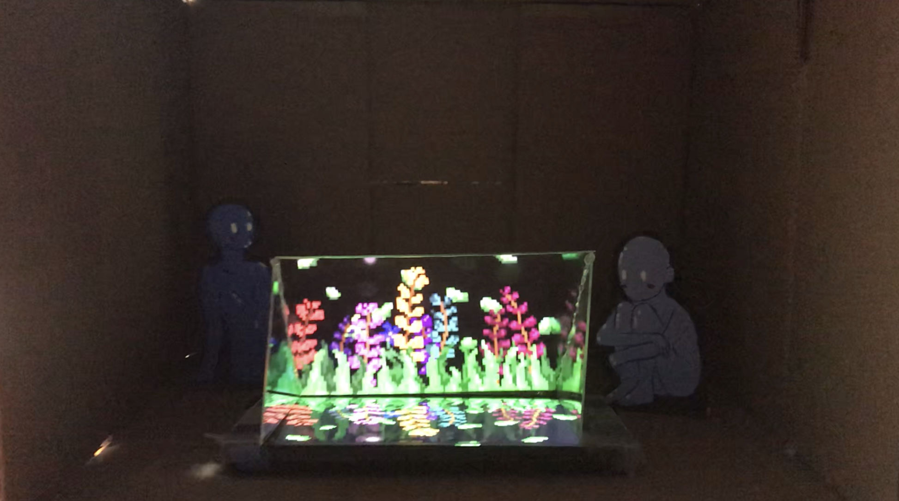

# Holography, work in progress

- Date: 04/14/20 through 04/18/20
- Medium: Photo of sketchbook
- Description: These are 3 sketches I did in the process of knowing what my final idea was going to be.

- Date: 04/21/20
- Medium: Gif made in Photoshop
- Description: This is the gif that I'm using as my hologram. 

- Date: 04/21/20
-Medium: Screenshot from video
-Description: The screenshop is from a video I took to show the progress from the other part of the project. 

I got inspired by the idea of the quarantine and being isolated from the outside. So, I decided to create a hypothetical scenario where holograms were real and how people would need to lean on this type of technology to cease their longing of going out. I did several sketches of what I wanted my artwork to be, until I decided to go with a small model of a room, with drawn people on the back, where the hologram -- which is going to be displayed through a reflection of my phone -- is the main focus of the piece. 
