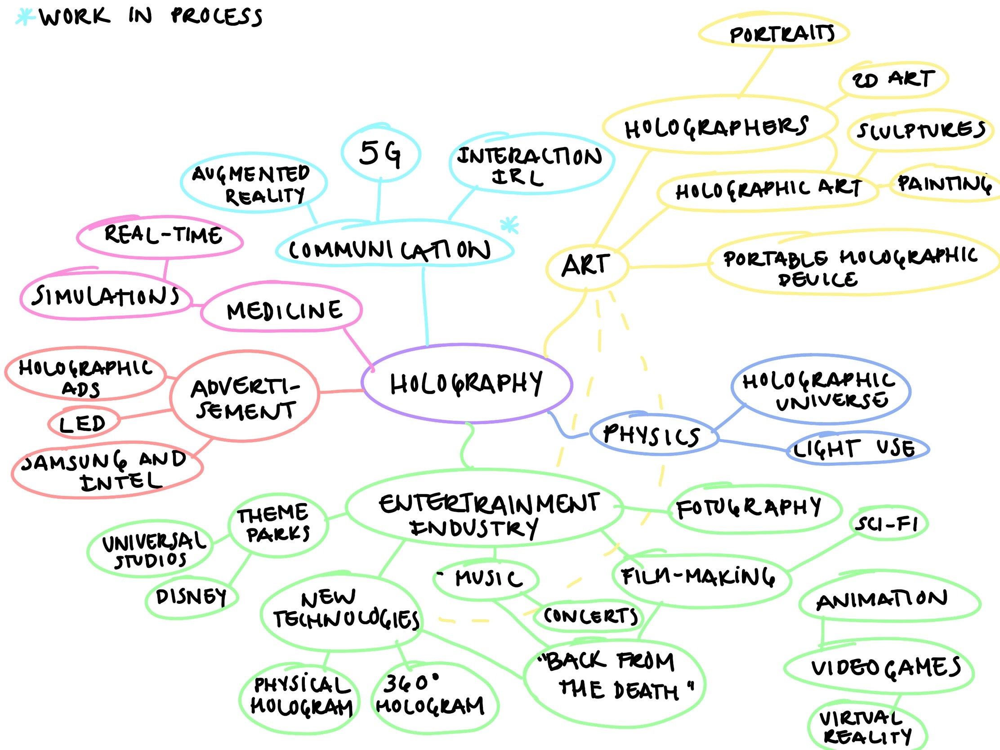
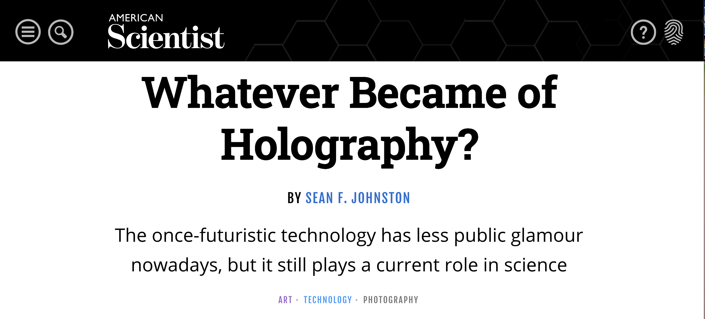
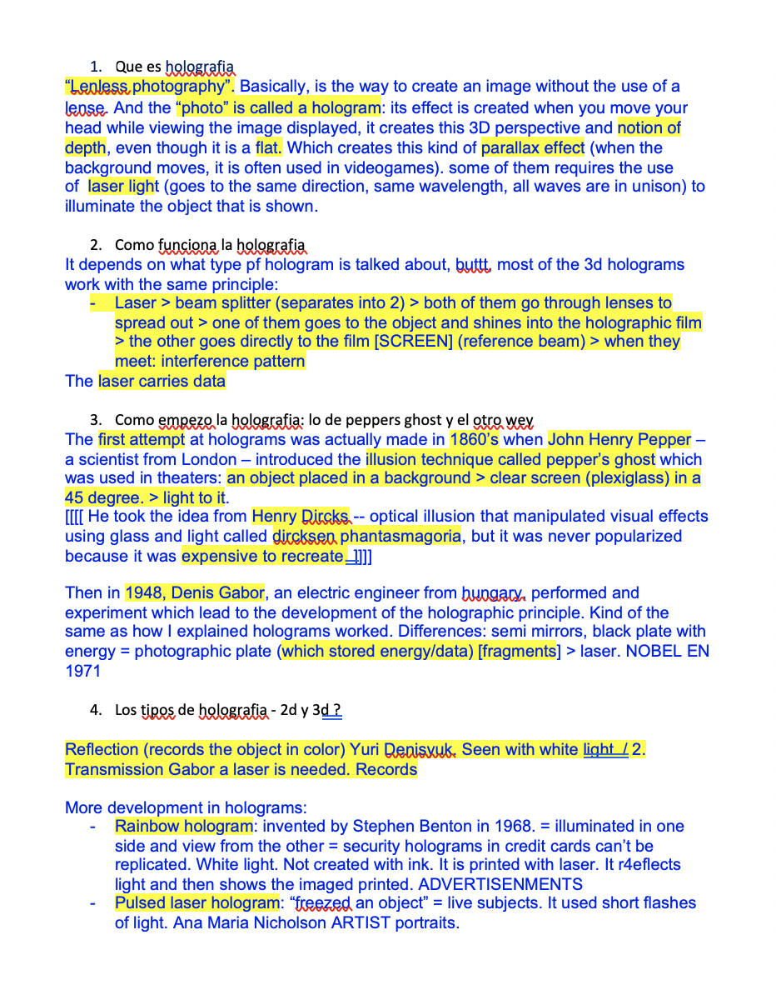

# HOLOGRAPHY Research

- Date: March 5 2020
- Description: This is the mind map I made in relation with the investigation that I did before.

- Date: March 4 2020 
- Description: This is one of the websites that I used for my research.  

- Date: March 4 2020
- Description: Screenshot of a document of my research. 

The first image is a screenshot of the mindmap that I made to put together the main points of my research on holography. It also helped me to organize my ideas and get a start point on the research. The second image is a screenshot of one of the websites that I use for a complete investigation. This was one of the most important source because it talks about the whole history of holograms since the beginning. Also, it explains from the scientific and artistic scene. For my research, I used about 10 websites and 5 videos from Youtube to get the most of it. Finally, the third image is a screenshot of one page of a script that I wrote for the presentation of my research. This script is only a summary of all my research, which helped me when presenting in front of my class. I went from its origins to its uses in art, and, finally, to its future development. 

